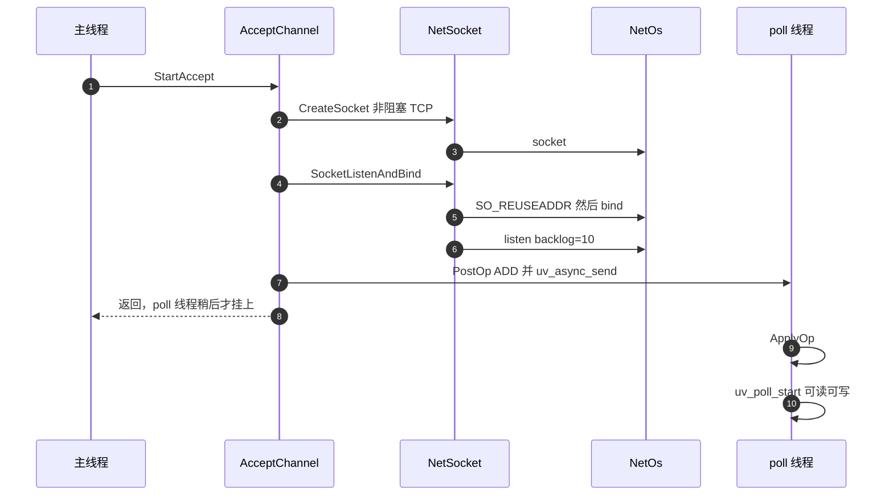

# 服务端开始听

`StartServer` 在主线程，poll 在另一条线程上。监听套接字先放进操作队列，由 poll 线程挂上。这里只 bind 和 listen，还没有连接。

```mermaid
sequenceDiagram
    autonumber
    participant Main as 主线程
    participant Acc as AcceptChannel
    participant Sock as NetSocket
    participant Os as NetOs
    participant Poll as poll 线程

    Main->>Acc: StartAccept
    Acc->>Sock: CreateSocket 非阻塞 TCP
    Sock->>Os: socket
    Acc->>Sock: SocketListenAndBind
    Sock->>Os: SO_REUSEADDR 然后 bind
    Sock->>Os: listen backlog=10
    Acc->>Poll: PostOp ADD 并 uv_async_send
    Acc-->>Main: 返回，poll 线程稍后才挂上
    Poll->>Poll: ApplyOp
    Poll->>Poll: uv_poll_start 可读可写
```
