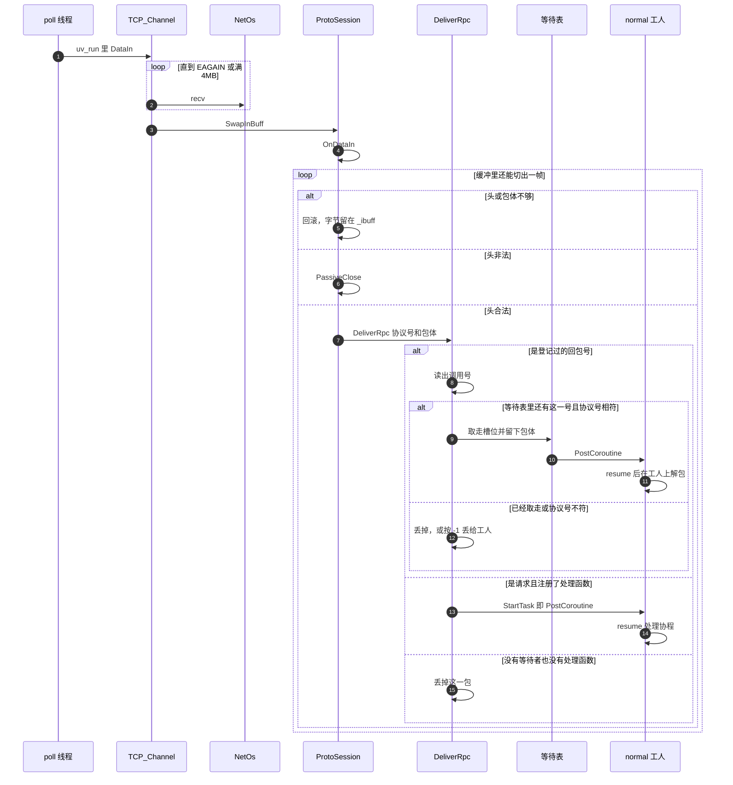

# 收到一帧

读发生在 poll 线程。一轮最多读 4MB。切出请求或回包之后，`Schedule` 和 `StartTask` 都把句柄放进 `normal` 工人队列。解包和处理在工人上，不在 poll 回调里 `resume`。

头或包体不够就留下，下一次可读再拼。

```mermaid
sequenceDiagram
    autonumber
    participant Poll as poll 线程
    participant Tcp as TCP_Channel
    participant Os as NetOs
    participant Sess as ProtoSession
    participant Rpc as DeliverRpc
    participant Wait as 等待表
    participant Worker as normal 工人

    Poll->>Tcp: uv_run 里 DataIn
    loop 直到 EAGAIN 或满 4MB
        Tcp->>Os: recv
    end
    Tcp->>Sess: SwapInBuff
    Sess->>Sess: OnDataIn
    loop 缓冲里还能切出一帧
        alt 头或包体不够
            Sess->>Sess: 回滚，字节留在 _ibuff
        else 头非法
            Sess->>Sess: PassiveClose
        else 头合法
            Sess->>Rpc: DeliverRpc 协议号和包体
            alt 是登记过的回包号
                Rpc->>Rpc: 读出调用号
                alt 等待表里还有这一号且协议号相符
                    Rpc->>Wait: 取走槽位并留下包体
                    Wait->>Worker: PostCoroutine
                    Worker->>Worker: resume 后在工人上解包
                else 已经取走或协议号不符
                    Rpc->>Rpc: 丢掉，或按 -1 丢给工人
                end
            else 是请求且注册了处理函数
                Rpc->>Worker: StartTask 即 PostCoroutine
                Worker->>Worker: resume 处理协程
            else 没有等待者也没有处理函数
                Rpc->>Rpc: 丢掉这一包
            end
        end
    end
```

迟到的回包发现调用号已经取走，就丢掉，不会配给下一次调用。
