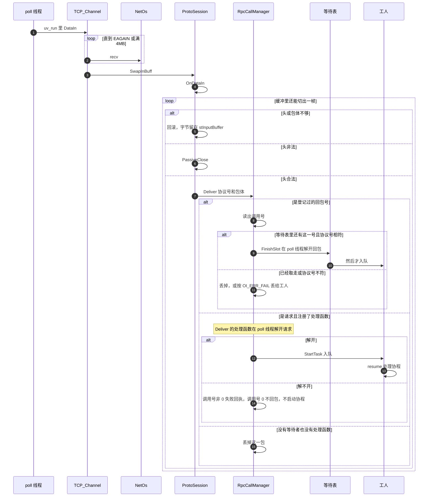

# 收到一帧

读发生在 poll 线程。一轮最多读 4MB。请求在 Deliver 的处理函数里解开后才 `StartTask`，回包在 `FinishSlot` 里解开后才把句柄放进工人队列。处理协程在工人上，不在 poll 回调里 `resume`。

头或包体不够就留下，下一次可读再拼。

```mermaid
sequenceDiagram
    autonumber
    participant Poll as poll 线程
    participant Tcp as TCP_Channel
    participant Os as NetOs
    participant Sess as ProtoSession
    participant Rpc as RpcCallManager
    participant Wait as 等待表
    participant Worker as 工人

    Poll->>Tcp: uv_run 里 DataIn
    loop 直到 EAGAIN 或满 4MB
        Tcp->>Os: recv
    end
    Tcp->>Sess: SwapInBuff
    Sess->>Sess: OnDataIn
    loop 缓冲里还能切出一帧
        alt 头或包体不够
            Sess->>Sess: 回滚，字节留在 stInputBuffer
        else 头非法
            Sess->>Sess: PassiveClose
        else 头合法
            Sess->>Rpc: Deliver 协议号和包体
            alt 是登记过的回包号
                Rpc->>Rpc: 读出调用号
                alt 等待表里还有这一号且协议号相符
                    Rpc->>Wait: FinishSlot 在 poll 线程解开回包
                    Wait->>Worker: 然后才入队
                else 已经取走或协议号不符
                    Rpc->>Rpc: 丢掉，或按 OI_ERR_FAIL 丢给工人
                end
            else 是请求且注册了处理函数
                Note over Rpc: Deliver 的处理函数在 poll 线程解开请求
                alt 解开
                    Rpc->>Worker: StartTask 入队
                    Worker->>Worker: resume 处理协程
                else 解不开
                    Rpc->>Rpc: 调用号非 0 失败回执，调用号 0 不回包，不启动协程
                end
            else 没有等待者也没有处理函数
                Rpc->>Rpc: 丢掉这一包
            end
        end
    end
```

迟到的回包发现调用号已经取走，就丢掉，不会配给下一次调用。
