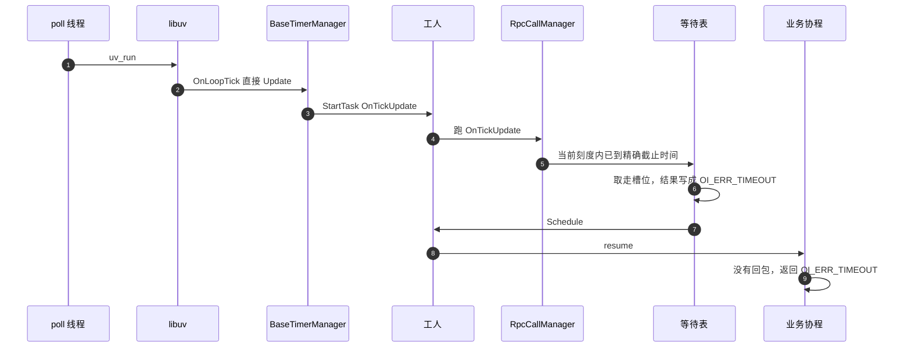

# 调用超时

时间轮在 poll 线程上直接 `Update`，再 `StartTask` 拉起 `RpcCallManager::OnTickUpdate`。扫描协程在工人上跑，不在 poll 回调里扫，也不在回调里 `resume`。

分桶仍按 200 毫秒刻度，桶内逐项按精确截止时间判断，计时用 `OI::Timer::SteadyMilliseconds`。超时精度取决于时间轮一跳（`offset_ms`，正常 10–50 毫秒）。已经发出之后到期写成 `OI_ERR_TIMEOUT`。还在等第一次连上就到期，写成 `OI_ERR_CONNECT`。

```mermaid
sequenceDiagram
    autonumber
    participant Poll as poll 线程
    participant Uv as libuv
    participant Timer as BaseTimerManager
    participant Worker as 工人
    participant Mgr as RpcCallManager
    participant Wait as 等待表
    participant Biz as 业务协程

    Poll->>Uv: uv_run
    Uv->>Timer: OnLoopTick 直接 Update
    Timer->>Worker: StartTask OnTickUpdate
    Worker->>Mgr: 跑 OnTickUpdate
    Mgr->>Wait: 当前刻度内已到精确截止时间
    Wait->>Wait: 取走槽位，结果写成 OI_ERR_TIMEOUT
    Wait->>Worker: Schedule
    Worker->>Biz: resume
    Biz->>Biz: 没有回包，返回 OI_ERR_TIMEOUT
```

发送失败或解包失败走同一条唤醒，结果是 `OI_ERR_FAIL`。先到的那个算数，后到的发现调用号已经取走，就不再动这条协程。
