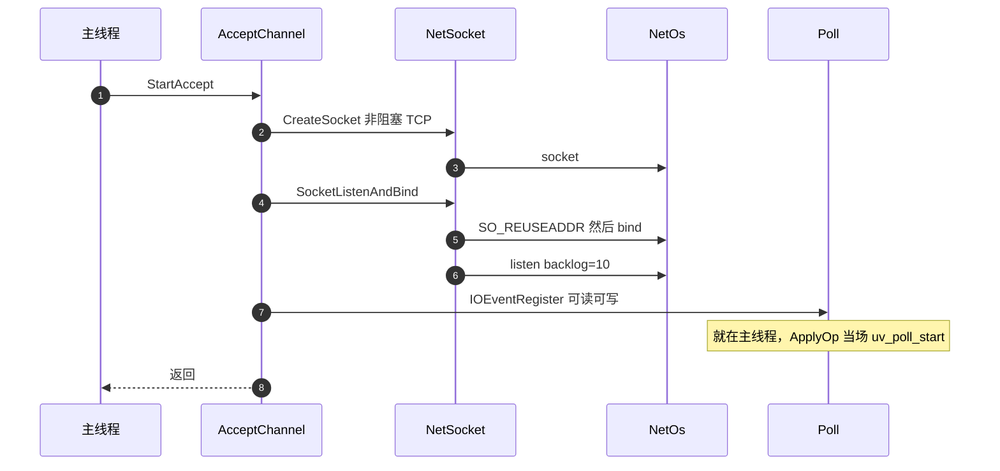

# 服务端开始听

`StartServer` 在主循环之前。主线程已经是 poll 线程，监听套接字当场挂上，不进操作队列。这里只 bind 和 listen，还没有连接。

```mermaid
sequenceDiagram
    autonumber
    participant Main as 主线程
    participant Acc as AcceptChannel
    participant Sock as NetSocket
    participant Os as NetOs
    participant Poll as Poll

    Main->>Acc: StartAccept
    Acc->>Sock: CreateSocket 非阻塞 TCP
    Sock->>Os: socket
    Acc->>Sock: SocketListenAndBind
    Sock->>Os: SO_REUSEADDR 然后 bind
    Sock->>Os: listen backlog=10
    Acc->>Poll: IOEventRegister 可读可写
    Note over Poll: 就在主线程，ApplyOp 当场 uv_poll_start
    Acc-->>Main: 返回
```
