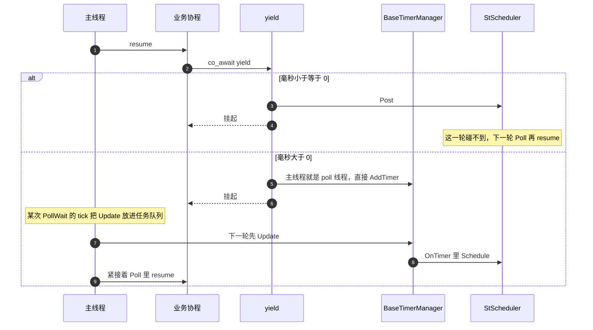

# 让出

空等用 `co_await yield(毫秒)`。单线程的业务协程就在 poll 线程上，`毫秒 > 0` 时直接 `AddTimer`，不用丢给别的线程。到点只把句柄放回队列，不在定时器回调里 `resume`。

`毫秒 <= 0` 不进时间轮。当前这轮 `Poll` 已经把队列拿走，新句柄要等下一轮。

```mermaid
sequenceDiagram
    autonumber
    participant Main as 主线程
    participant Biz as 业务协程
    participant Yld as yield
    participant Timer as BaseTimerManager
    participant Queue as StScheduler

    Main->>Biz: resume
    Biz->>Yld: co_await yield
    alt 毫秒小于等于 0
        Yld->>Queue: Post
        Yld-->>Biz: 挂起
        Note over Queue: 这一轮碰不到，下一轮 Poll 再 resume
    else 毫秒大于 0
        Yld->>Timer: 主线程就是 poll 线程，直接 AddTimer
        Yld-->>Biz: 挂起
        Note over Main: 某次 PollWait 的 tick 把 Update 放进任务队列
        Main->>Timer: 下一轮先 Update
        Timer->>Queue: OnTimer 里 Schedule
        Main->>Biz: 紧接着 Poll 里 resume
    end
```
